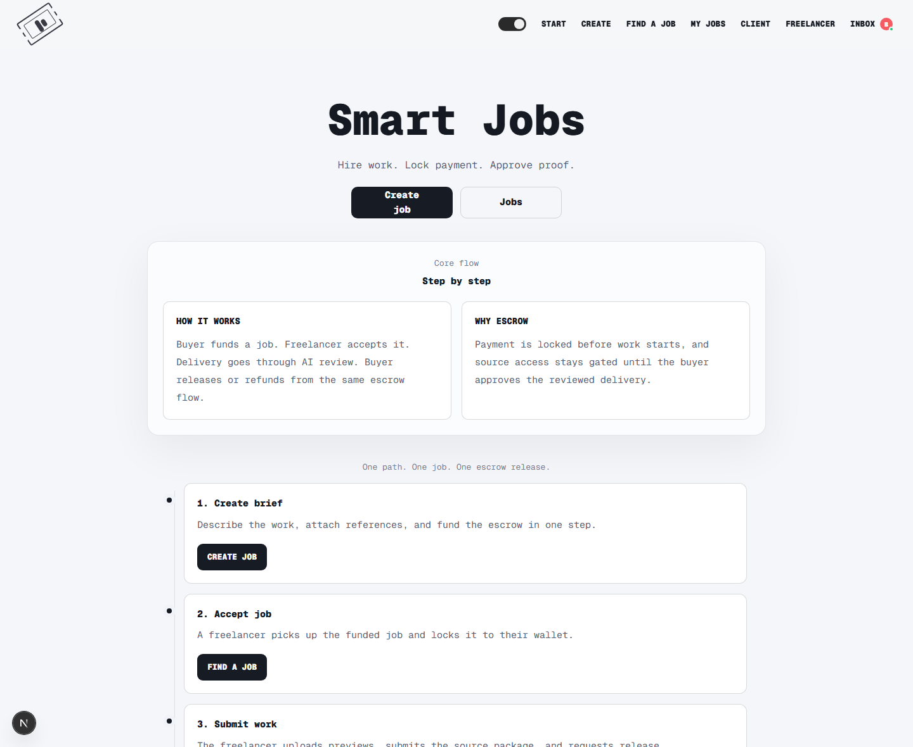
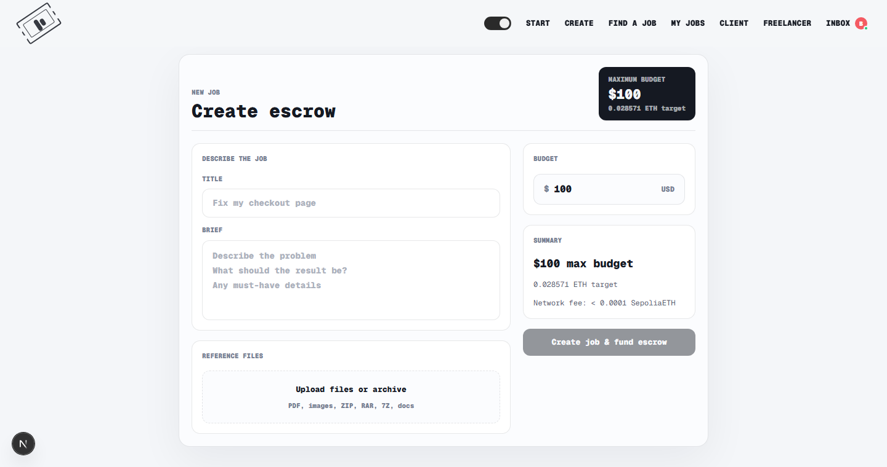
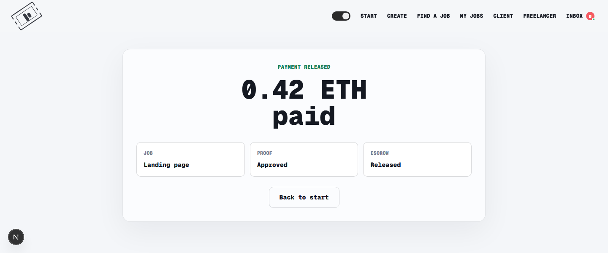
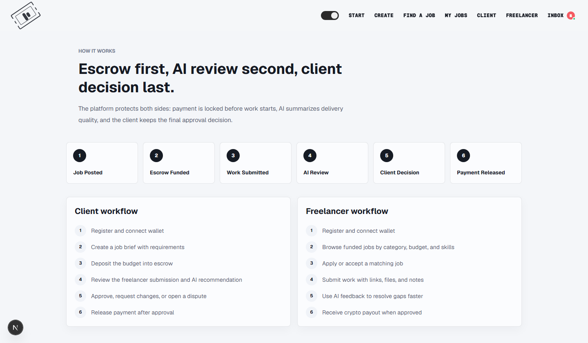
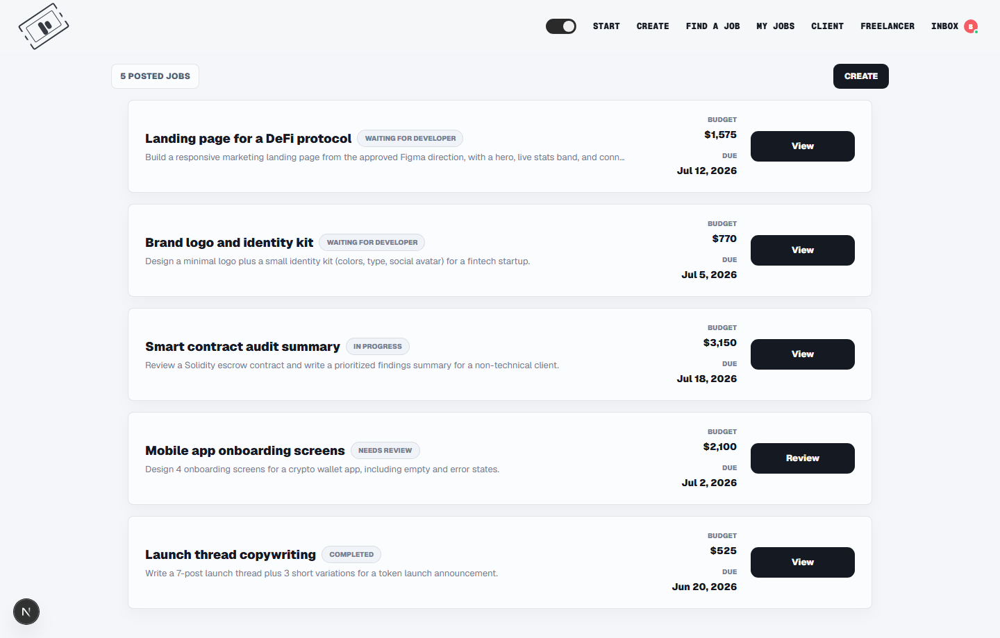
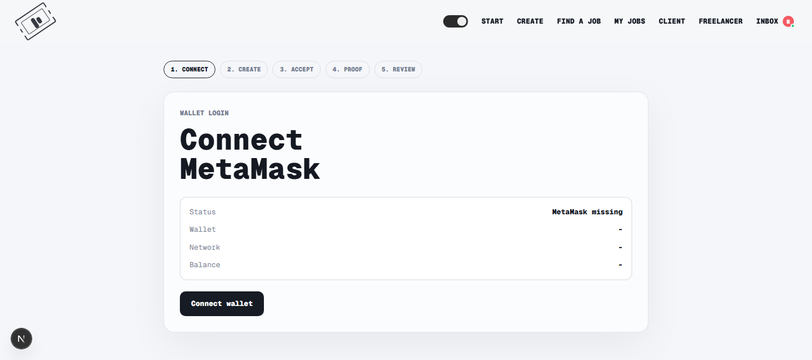

# Smart Jobs

> **Hire work. Lock payment. Approve proof.**
> Crypto freelance escrow with an AI delivery-review layer — payment is locked on-chain before work starts and released only after the delivery is reviewed.

<p align="center">
  
</p>

<p align="center">
  <a href="#what-it-is">Overview</a> ·
  <a href="#the-user-flow">User flow</a> ·
  <a href="#screens">Screens</a> ·
  <a href="#tech-stack">Tech stack</a> ·
  <a href="#getting-started">Getting started</a> ·
  <a href="#smart-contract">Smart contract</a>
</p>

> ⚠️ **Hackathon / demo project.** It runs on the **Sepolia testnet** and the screenshots below use **demo data**. Do not use it with real funds or a main wallet.

---

## What it is

Hiring a freelancer with crypto has two trust gaps:

1. **The buyer** doesn't want to pay before seeing the work.
2. **The freelancer** doesn't want to do the work before knowing the money exists.

Smart Jobs closes both gaps with a single escrow flow:

- The **buyer funds an escrow contract on-chain** when the job is created — the money is provably locked, but held by the contract, not the platform.
- The **freelancer accepts the funded job** and binds it to their own wallet.
- On delivery, an **AI reviewer** scores the work against the brief and gives the buyer a clear recommendation.
- The **buyer makes the final call** — release the payment or refund — directly from the escrow.

```
Buyer funds escrow ──► Freelancer locks job ──► Work submitted ──► AI review ──► Buyer releases / refunds
       on-chain               on-chain             + preview         scored        on-chain payout
```

Three layers do the work:

| Layer | Responsibility |
| --- | --- |
| 🔒 **Smart contract** (Solidity, Sepolia) | Secures the payment — fund, lock, request release, release, refund. |
| 🐝 **Swarm verified fetch** | Secures content integrity — delivery evidence can be fetched from any gateway and verified client-side. |
| 🤖 **AI review** (OpenAI) | Interprets the verified evidence and recommends a decision to the buyer. |

> Smart Jobs verifies not only **who gets paid**, but also **what content was actually reviewed**.

---

## The user flow

### 1. Post a job and fund escrow in one step

The buyer writes a brief, attaches reference files, and sets a budget. The summary shows the ETH escrow target and the network fee before funding.



### 2. A freelancer finds a funded job

Only **funded** jobs appear on the board, so freelancers never start work that isn't backed by locked escrow. They accept the job and lock it to their wallet.


### 3. AI reviews the delivery, the buyer decides

After the freelancer submits a watermarked preview and the source package, the AI scores the work against the brief and recommends an action. The buyer releases the escrow or refunds — and only then is the high-quality source unlocked.


### 4. Payment is released on-chain

When the buyer approves, the contract pays the freelancer and emits a release event. The flow ends with a clear payout confirmation.



---

## Screens

| How it works | My jobs | Connect wallet |
| --- | --- | --- |
|  |  |  |

---

## Features

- **On-chain escrow** — fund, lock, request-release, release and refund handled by the `SmartJobsEscrow` contract on Sepolia.
- **Wallet-native flow** — the freelancer accepts with their own wallet (`lockEscrow`); only the buyer can `release`.
- **AI delivery review** — every submission is scored against the brief with a verdict (`pass` / `needs revision` / `fail`), a confidence score, matched requirements and open issues.
- **Gated source access** — the buyer sees a watermarked preview; the original deliverable unlocks only after release.
- **Swarm verified fetch** — a standalone TS/JS library that fetches from any Swarm gateway and cryptographically verifies the content client-side, in the browser or Node, with no full node required.
- **Demo-ready UX** — a single, linear job lifecycle that's easy to walk through end to end.

---

## Tech stack

- **Framework:** Next.js 16 (App Router, Turbopack) + React 19
- **Styling:** Tailwind CSS v4 (monospace brutalist theme, light/dark)
- **Language:** TypeScript, validated with Zod
- **Contracts:** Solidity + Hardhat 3 + Hardhat Ignition, viem
- **AI:** OpenAI API (delivery review)
- **Storage:** Swarm via `@ethersphere/bee-js` + a custom verified-fetch library
- **Network:** Ethereum **Sepolia** testnet

---

## Getting started

### Prerequisites

- Node.js **20+** (developed on Node 22)
- npm
- A browser wallet (MetaMask) on the **Sepolia** network for the on-chain steps
- *(Optional)* an OpenAI API key to run live AI reviews

### 1. Install

```bash
npm install
```

### 2. Configure environment

Copy the example file and fill in your values:

```bash
cp .env.example .env.local
```

```dotenv
# AI review (server-only — never expose client-side)
OPENAI_API_KEY=
OPENAI_MODEL=gpt-4.1-mini

# Sepolia deployment (use a funded throwaway deployer key, never a main wallet)
SEPOLIA_RPC_URL=https://sepolia.infura.io/v3/YOUR_KEY
SEPOLIA_PRIVATE_KEY=0xYOUR_FUNDED_DEPLOYER_PRIVATE_KEY
ETHERSCAN_API_KEY=YOUR_ETHERSCAN_API_KEY

# Filled after deploying SmartJobsEscrow
NEXT_PUBLIC_SMARTJOBS_ESCROW_ADDRESS=
```

> The app reads `NEXT_PUBLIC_SMARTJOBS_ESCROW_ADDRESS` at boot. **Restart the dev server after changing `.env.local`**, or the frontend may keep using an old contract address.

### 3. Run

```bash
npm run dev
```

Open [http://localhost:3000](http://localhost:3000).

The job board starts empty — create a job from **Post a Job**, or POST seed jobs to the `/jobs` API to populate the demo.

---

## Smart contract

The escrow logic lives in [`contracts/SmartJobsEscrow.sol`](contracts/SmartJobsEscrow.sol).

| Action | Who | Effect |
| --- | --- | --- |
| `createEscrow` | Buyer | Funds the escrow; funds held by the contract. |
| `lockEscrow` | Freelancer | Accepts a funded job from their own wallet. |
| `requestRelease` | Freelancer | Requests payout review. |
| `release` | Buyer | Pays the freelancer `bidAmount`, returns any remainder. |
| `refund` | Buyer | Refunds from `Funded`, `Locked`, `ReleaseRequested` or `Disputed`. |

Current Sepolia deployment: **`0x81dfFC433dcE76dB8915726a476d97E19Af96557`**
([view on Sepolia Etherscan](https://sepolia.etherscan.io/address/0x81dfFC433dcE76dB8915726a476d97E19Af96557)).

```bash
npm run contracts:compile                 # compile
npm run contracts:test                    # run contract tests
npm run contracts:deploy:sepolia:verify   # deploy + verify on Sepolia
```

---

## Project scripts

| Script | Description |
| --- | --- |
| `npm run dev` | Start the Next.js dev server. |
| `npm run build` / `npm run start` | Production build / serve. |
| `npm run lint` | Lint the project. |
| `npm test` | Run the app test suite. |
| `npm run contracts:compile` | Compile the Solidity contracts. |
| `npm run contracts:test` | Run the contract tests. |
| `npm run contracts:deploy:sepolia` | Deploy `SmartJobsEscrow` to Sepolia. |

---

## Project structure

```
app/                 Next.js App Router pages + API routes (/jobs, /api/review, /api/swarm, …)
components/          UI: job cards, review console, wallet connect, workflow stepper, …
lib/
  contracts/         Escrow ABI + on-chain action helpers
  review/            AI review prompt, schema, and service
  swarm/             Swarm client + verified-fetch library
  workflow/          Domain schema + in-memory job/escrow store
contracts/           SmartJobsEscrow.sol + deployment log
ignition/            Hardhat Ignition deployment modules
docs/screenshots/    Screenshots used in this README
```

---

## Disclaimer

This is a hackathon build for demonstration. It runs on the **Sepolia testnet**, the UI carries an optimistic confirmation gap (it records local state on a tx hash before the receipt is mined), and the screenshots use generated demo data. Verify any transaction on Sepolia Explorer before trusting the UI state. Do not use real funds.
